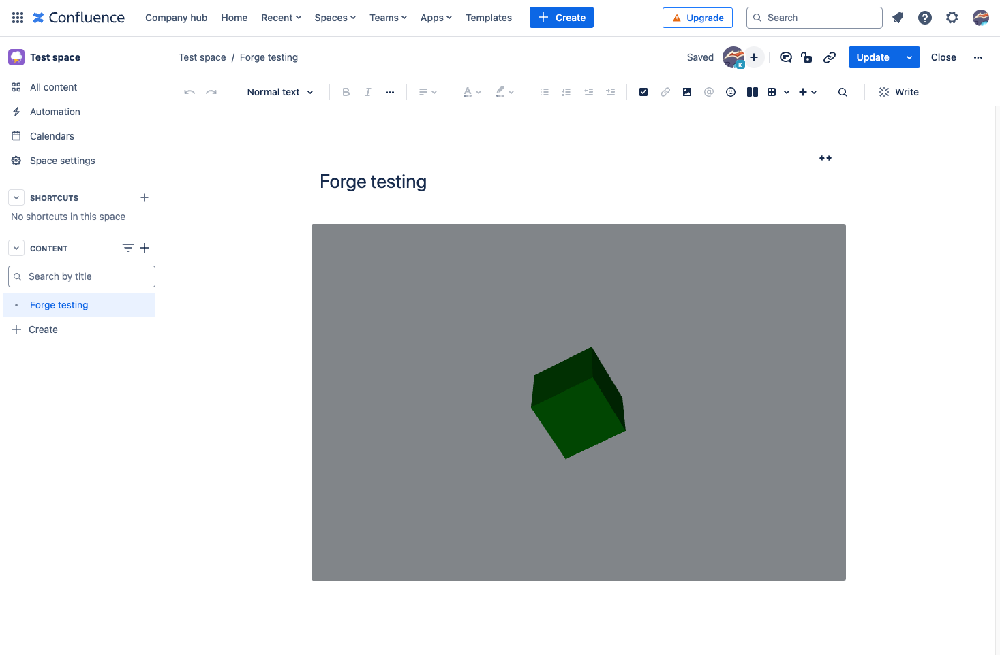

# Forge-r3f-template

This project contains a template for running R3F app within Atlassian forge, specifiaclly:
- Custom UI
- Confluence macro



See [developer.atlassian.com/platform/forge/](https://developer.atlassian.com/platform/forge) for documentation and tutorials explaining Forge.


## Quick start
- Install top-level dependencies:
```
npm install
```

- Modify your app by editing the files in `src/App.jsx` or `src/components/Experience.jsx`.

- Build your app (should result in a build folder with the same path as manifest.yml `resources:`):
```
npm run build
```

- Register the app under the logged in user,updating the manifest with a new `app: id:`
```
forge register forge-r3f-template
```

- Deploy your app by running:
```
forge deploy
```

- Install your app in an Atlassian site by running:
```
forge install
```
- Use macro in confluence page:
/"your app title"

### Notes
- Use the `forge deploy` command when you want to persist code changes.
- Use the `forge install` command when you want to install the app on a new site.
- Once the app is installed on a site, the site picks up the new app changes you deploy without needing to rerun the install command.
- Control the viewport size within manifest: `viewportSize: large`


